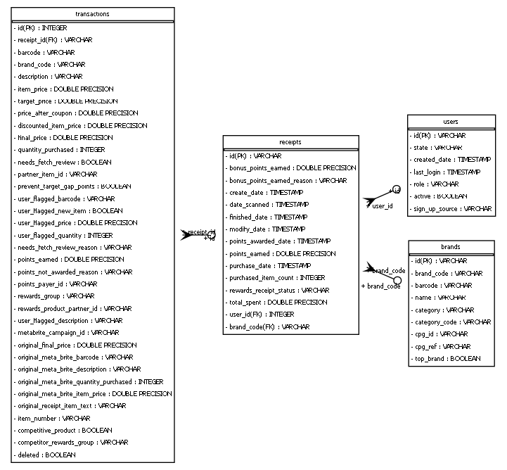

# Overview
The following tables are declared in the models.py folder. I am using SQL alchemy to interact with
the database. For the most part, these schemas are consistent with the data provided in the JSON files, with
the addition of a transactions table.

## Implementation Limitations
Due to the many issues in the data I could not implement all the relationships between the tables. 
These are missing:
* Receipts.user_id -> Users.id
* Receipt.brand_code -> Brand.brand_code

# ER Diagram
